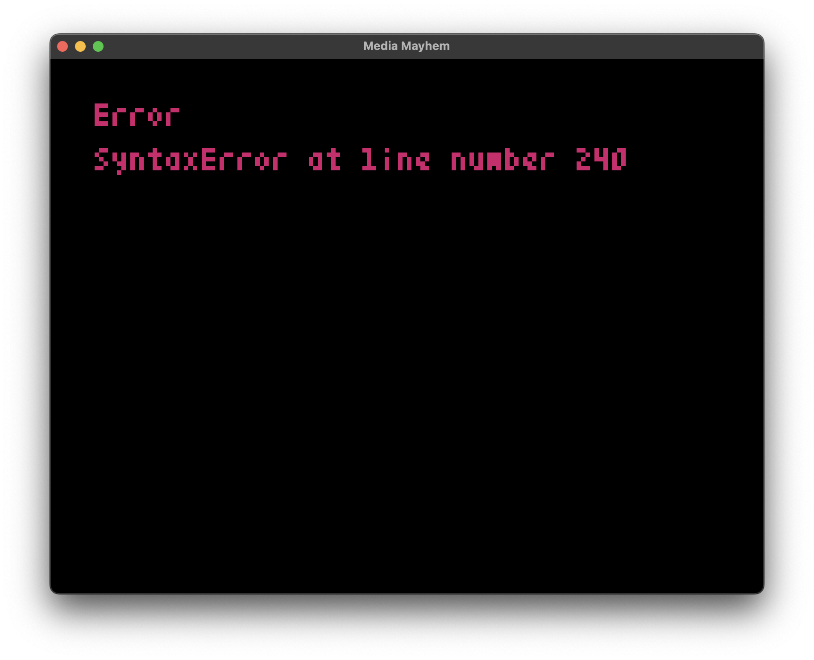

# pyxel-reload

A hot-reloading development tool for [Pyxel](https://github.com/kitao/pyxel) games that automatically refreshes your game when code or asset files change.

## Features

- Hot reloading of Python code changes
- Automatic reloading when .pyxres asset files change
- Error display in both console and game window
- Simple integration with existing Pyxel games

## Installation

Install via pip:

```bash
pip install pyxel-reload
```

## Usage

1. Ensure your game file has an `update` and `draw` function
2. Ensure `pyxel.run` is only called when run as a script

```python
import pyxel

pyxel.init(160, 120)

def update():
    if pyxel.btnp(pyxel.KEY_Q):
        pyxel.quit()

def draw():
    pyxel.cls(0)
    pyxel.text(10, 10, "Hello, Pyxel!", pyxel.frame_count % 16)

if __name__ == "__main__":
    pyxel.run(update, draw)
```

3. Run your game with pyxel-reload:

```bash
pyxel-reload game
```

Where `game` is the name of your Python module (without the .py extension).

4. Make changes to your code or .pyxres files and see them reload automatically!

## Error Handling

When errors occur during reload:
- Error details are displayed in the console
- A basic error message appears in the game window
- The game continues running and will reload once errors are fixed


